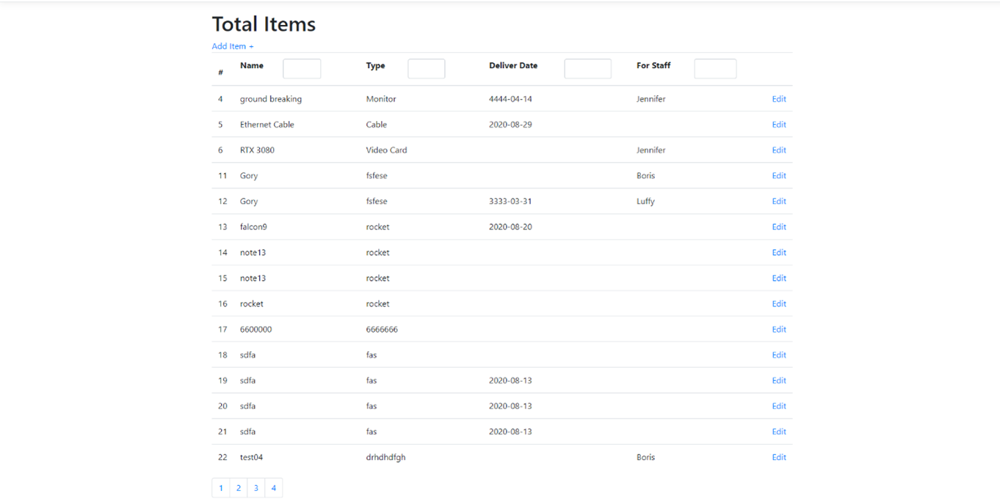

# Equipment-Management

A protype of Equimpment Management System. 
This system is used to manage the purchasing information of equipment, which including the Name, Type, Delivery day, and the staff. 
The main function of this is are Add new equipment, Edit the exist equipment, Check the history record. 

Framework: React 
Backend: .Net Core 3.1 
DB:MySql 
Package: Reactstrap/React-router/Dapper 

 

